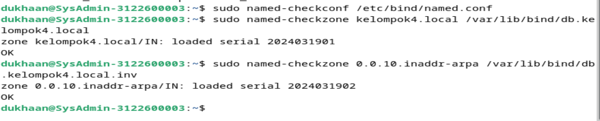
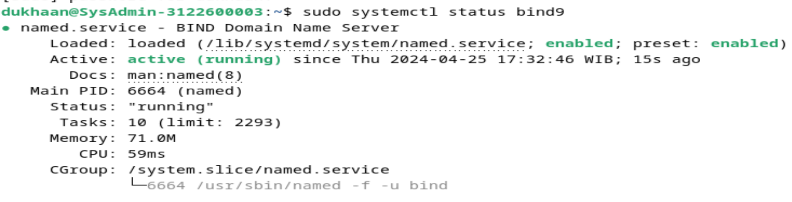
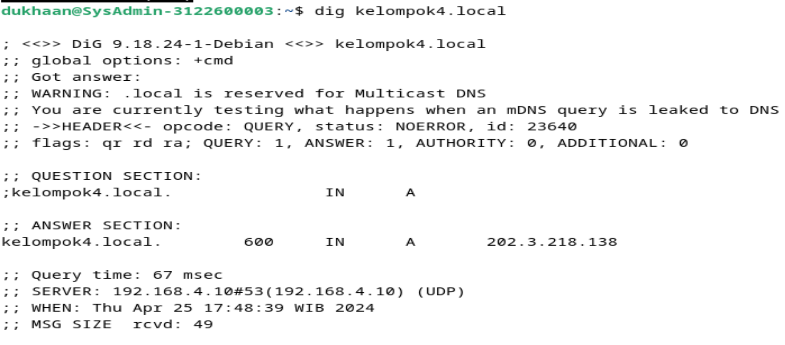

    Nama            : Dukhaan Kamimpangan
    NRP             : 3122600003
    Kelas           : 2 D4 IT A
    Mata Kuliah     : Workshop Administrasi Jaringan
    Dosen Pengampu  : Dr. Ferry Astika Saputra S.T., M.Sc
    Pertemuan       : Minggu 3

# INSTALLASI DNS SERVER

### Langkah 1: Instalasi BIND9

1. Masuk terminal linux
2. Update paket sistem:
   ```bash
   sudo apt update
   sudo apt upgrade
   ```
3. Install BIND9:
   ```bash
   sudo apt install bind9 bind9-dnsutils bind9-doc
   ```

### Langkah 2: Konfigurasi BIND9

1. Edit file `/etc/bind/named.conf` :

   ```bash
   sudo nano /etc/bind/named.conf
   ```

   ```bash
    acl internals { 127.0.0.0/8; 192.168.110.10/16; };

    include "/etc/bind/named.conf.options";
    controls {
            inet 127.0.0.1 port 953 allow { 127.0.0.1; };
    };

    include "/etc/bind/named.conf.local";
    include "/etc/bind/named.conf.default-zones";
   ```

2. Edit file `/etc/bind/named.conf.options` :

   ```bash
   sudo nano /etc/bind/named.conf.options
   ```

   ```bash
    forwarders {
            202.9.85.3;
            202.9.85.4;
    };

    auth-nxdomain no;
    dnssec-validation auto;

    listen-on-v6 { none; };

    listen-on { 127.0.0.1; 192.168.110.10; };

    allow-transfer { none; };

    allow-query { internals; };

    allow-recursion { internals; };

    version none;
   ```

3. Edit file `/etc/bind/named.conf.local` :

   ```bash
   sudo nano /etc/bind/named.conf.local
   ```

   ```bash
    zone "kelompok4.local" {
            type master;
            file "/var/lib/bind/db.kelompok4.local";
    };

    zone "110.168.192.in-addr.arpa" {
            type master;
            file "/var/lib/bind/db.kelompok4.local.inv";
    };
   ```

4. Edit file `/var/lib/bind/db.kelompok4.local` :

   ```bash
   sudo nano /var/lib/bind/db.kelompok4.local
   ```

   ```bash
   $TTL    3600
   @       IN      SOA     ns.kelompok4.local. root.kelompok4.local. (
                     2024042101            ; Serial
                           3600            ; Refresh [1h]
                            600            ; Retry   [10m]
                          86400            ; Expire  [1d]
                            600 )          ; Negative Cache TTL [1h]
   ;
   @       IN      NS      ns.kelompok4.local.
   @       IN      MX      10 ns.kelompok4.local.

   ns      IN      A       192.168.110.10

   www     IN      CNAME   ns
   mail    IN      CNAME   ns
   ```

5. Edit file `/var/lib/bind/db.kelompok4.local.inv` :

   ```bash
   sudo nano /var/lib/bind/db.kelompok4.local.inv
   ```

   ```bash
   $TTL    3600
   @       IN      SOA     ns.kelompok4.local. root.kelompok4.local. (
                     2024042102           ; Serial
                           3600           ; Refresh [1h]
                            600           ; Retry   [10m]
                          86400           ; Expire  [1d]
                            600 )         ; Negative Cache TTL [1h]
   ;
   @       IN      NS      ns.kelompok4.local.

   10      IN      PTR     ns.kelompok4.local.
   ```

6. Edit file `/etc/resolv.conf` :

   ```bash
   sudo nano /etc/resolv.conf
   ```

   ```bash
   search kelompok4.local
   nameserver 192.168.110.10
   nameserver 10.10.10.1
   nameserver 202.9.85.3
   ```

### Langkah 4: Periksa Konfigurasi dan Restart BIND9

1. Periksa kesalahan konfigurasi:

   ```bash
   sudo named-checkconf /etc/bind/named.conf
   sudo named-checkzone kelompok4.local /var/lib/bind/db.kelompok4.local
   sudo named-checkzone 0.0.10.inaddr-arpa /var/lib/bind/db.kelompok4.local.inv
   ```

   

2. Restart BIND9:

   ```bash
   sudo systemctl restart bind9
   ```

3. Periksa status BIND9 untuk memastikan tidak ada kesalahan:

   ```bash
   sudo systemctl status bind9
   ```

   

4. Uji setup DNS

   ```bash
   dig kelompok4.local
   dig
   ```

   
   
